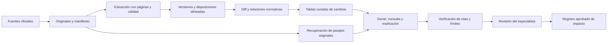

# Caso preliminar: revisión de cambios normativos SBS con Genie

> Antecedente v0.1. Para alcance y decisiones actuales consultar [spec v0.2](12-spec-agente-v0.2.md), que incorpora dos familias, RAG híbrido y conversación sin revisión experta previa.

**Estado: análisis v0.1. No hay nuevo agente implementado ni validación jurídica.** Supuesto por confirmar: banco peruano, equipo de riesgos/cumplimiento, corpus oficial público y especialista que decide aplicabilidad. El usuario confirmó que el objetivo es construir el E2E completo considerando las 12 decisiones, las capas y las etapas. Esta fase documenta análisis; no se cambió el workspace ni se habilitaron funciones beta.

## Promesa a demostrar

Cuando ingrese una nueva publicación oficial de la familia normativa acordada, el analista podrá ver qué disposiciones cambiaron frente a una versión identificada, consultar los pasajes anterior/nuevo y preparar una propuesta de impacto con incertidumbres explícitas. Un especialista revisa la aplicabilidad y aprueba el registro de obligaciones. Tiempo, ahorro y precisión aún no medidos: no prometerlos.

Separar cuatro preguntas: **qué texto cambió**, **qué norma modifica a cuál**, **qué está vigente para una fecha/entidad** y **qué proceso interno debe cambiar**. El diff resuelve solo parte de la primera. Las otras requieren relaciones normativas, reglas temporales y contexto del banco.

## Fuentes iniciales comprobadas

La SBS ofrece un portal de normativa y un compendio que distingue, entre otros, sistema financiero, seguros, pensiones y COOPAC. Esa clasificación permite acotar el corpus; no demuestra por sí sola completitud histórica ni disponibilidad de todas las versiones. [Portal normativo SBS](https://www.sbs.gob.pe/normativa-y-estandares/normativa/normativa-sbs) y [compendio oficial](https://www.sbs.gob.pe/app/pp/int_cn/paginas/busqueda/BusquedaCompendio.aspx), consultados 27-sep-2026.

Antes de recolectar masivamente: identificar una familia, norma base, modificatorias, anexos y versiones realmente disponibles; contrastar publicación oficial, texto consolidado y fecha de consulta. No inferir “vigente” de nombre de archivo, posición en buscador ni fecha de descarga. Si falta la versión anterior, devolver “comparación incompleta”. No se ha certificado ninguna obligación concreta en esta entrega.

## Lo reutilizable y lo que falta

El laboratorio [S05 de vigencia SBS](/Users/macdenix/clawd/projects/databricks-ai-engineer-s05-vigencia-sbs-lab/README.md) ofrece un antecedente directo: tablas, fixtures y diff determinista por artículo. Hay que reemplazar hashes ilustrativos, documento fijo y overwrite; reconciliar tools declaradas/implementadas; añadir alineamiento y demostrar ejecución E2E. El supervisor de ese notebook no es un Genie publicado. Ver [auditoría](../evidence/sbs-forensic-genie.md).

Reutilización por patrón: validación de citas completas de research-citas; conservación de páginas/offsets de PL00098; semántica y versionado de Genie de Ianbal; gate humano de LangGraph; separación de ejecución/asistencia de TYV; prueba de entrega real de S08. Reutilizar requiere adaptar y probar; no supone que esos componentes ya satisfagan requisitos SBS.

## Papel actual de Genie

La documentación distingue Chat, centrado en consultas estructuradas, y Agent mode. Genie Agents es el nombre actual de lo antes llamado Spaces. Su configuración incluye metadatos, instrucciones, ejemplos y benchmarks. Propuesta: usar Genie para consultar tablas curadas de versiones/cambios y preguntas del analista. [Conceptos oficiales](https://docs.databricks.com/aws/en/genie-agents/concepts).

Agent mode también puede analizar archivos de volúmenes UC mediante una función **beta**, habilitada por administrador, y citar páginas. Tiene requisitos de acceso y límites; no ofrece búsqueda web en ese flujo. No se comprobó su disponibilidad en el workspace del curso. Propuesta: comparar esa opción con recuperación controlada, usando el mismo corpus y prueba. No habilitarla solo por aparecer en la documentación. [Archivos en volúmenes](https://docs.databricks.com/aws/en/genie-agents/volumes).

Los benchmarks ayudan a medir respuestas; deben acompañarse de casos jurídicos adjudicados y comprobaciones de los pares de textos. Un resultado SQL correcto no acredita interpretación normativa. [Pruebas y monitoreo de Genie](https://docs.databricks.com/aws/en/genie-agents/monitor).

La arquitectura recomendada es una **hipótesis de diseño**: extracción, trazabilidad, temporalidad y diff explícitos; Genie como acceso conversacional a hechos gobernados; síntesis e impacto sujetos a revisión. La alternativa de cargar PDFs directamente se evalúa, no se descarta por una limitación antigua de Genie ni se acepta sin medición.

## Contratos mínimos propuestos

| Entidad | Campos/relaciones esenciales | Control |
|---|---|---|
| Documento fuente | ID, URL oficial, fecha captura/publicación, hash SHA256 real, tipo, archivo, páginas | Original inmutable, duplicados por contenido, origen comprobado |
| Norma/versión | ID norma, ID versión, versión documental, norma modificatoria, tipo acto, estado de revisión | Identidad estable; relaciones modifica/deroga/corrige; no asumir secuencia por número |
| Disposición | versión, artículo/inciso/anexo, texto original, texto normalizado, página y offsets | Cita completa localizable; tablas y OCR conservados; extracción versionada |
| Alineamiento | disposición anterior/nueva, tipo 1:1/1:n/n:1, confianza de alineamiento, revisión | Renumeración, fusión y traslado no equivalen automáticamente a alta/baja |
| Cambio | par de versiones, tipo literal/estructural, antes/después, evidencias, estado | No mezclar detección con interpretación; reejecución idempotente |
| Temporalidad | publicado_en, conocido_desde, efecto_desde/hasta, motivo/fuente y revisión | Fecha de publicación, captura y efecto distintas; conservar correcciones retroactivas |
| Impacto propuesto | cambio, entidad/proceso, explicación, sustento, incertidumbre, aprobador y fecha | Contexto del banco necesario; “no determinado” si falta |
| Corrida | corpus/hash, código, extractor, prompt/modelo/Genie config, pregunta, tools, costo/latencia | Reproducibilidad y segregación entre resultado autónomo y corrección humana |

La temporalidad propuesta separa lo que era efectivo de lo que el sistema conocía en una fecha. Los plazos o efectos legales se extraen de fuentes y se revisan; no se rellenan con reglas genéricas inventadas.

Salida mínima al analista: norma y par de versiones; estado de cobertura; artículo/anexo; cambio literal; ambos pasajes con enlaces/página; relación normativa que sustenta la comparación; interpretación tentativa separada; pendientes; decisión de revisión. “Sin cambios” solo si el par está completo y el procesamiento no falló.

## Revisión de las nueve etapas de preparación del nuevo caso

| Capa | Resultado del análisis actual | Falta para acreditar preparación |
|---|---|---|
| Fundación | Fuentes públicas y antecedente identificados | Corpus real, cobertura e integridad de versiones |
| Contratos/gobierno | Modelo conceptual propuesto | Dueños, diccionario aprobado y permisos reales |
| Conocimiento | Patrones de citas y recuperación reutilizables | Benchmark sobre artículos/anexos SBS reales |
| Orquestación | Flujo propuesto y límites de herramientas | Implementación, fallos e idempotencia probados |
| Modelo | Genie considerado; capacidades consultadas | Prueba comparativa y disponibilidad en entorno |
| Seguridad | Solo lectura inicial y separación de corpus/órdenes | Accesos, datos internos, retención y pruebas negativas |
| Evaluación | Métricas y protocolo propuestos | Gold adjudicado, holdout y umbrales acordados |
| Observabilidad | Contrato de corrida propuesto | Trazas, costos y monitoreo funcionando |
| IA responsable/despliegue | HITL, rollback y límites definidos a nivel diseño | Aceptación, runbook, despliegue y prueba de UI |

Todos son estados de análisis; no nueve etapas completadas. Las capas runtime están aplicadas en docs/08-capas-arquitectura.md.

## Prueba decisiva propuesta

Empezar por **una familia normativa y un pequeño conjunto de pares reales**, seleccionados con el especialista. Incluir adición, eliminación, modificación, renumeración, cambios en tablas/anexos, corrección formal sin cambio sustantivo, entrada en vigor diferida, documento incompleto y norma ajena al ámbito. El volumen exacto se fija después de ver disponibilidad; una muestra pequeña no estima por sí sola fiabilidad operacional.

Construir referencia humana por disposición antes de ajustar el agente. Reservar familias o pares completos para evaluación; no repartir artículos vecinos del mismo documento entre entrenamiento y prueba. Congelar corpus, extractor, config Genie, prompts y rúbrica. Registrar correcciones del gold y repetir versiones afectadas. No incluir respuestas del holdout como ejemplos del agente.

| Métrica | Denominador/criterio | Por qué importa |
|---|---|---|
| Cobertura documental | Versiones/disposiciones procesadas respecto del inventario acordado | Los documentos omitidos deben ser visibles |
| Recall de cambios | Cambios de referencia detectados / cambios reales adjudicados | Omisiones que el usuario no ve |
| Precisión de cambios | Cambios detectados correctos / cambios propuestos | Carga de revisión y falsas alarmas |
| Alineamiento correcto | Pares de disposiciones correctos / pares evaluados | Dos citas verdaderas pueden corresponder a artículos distintos |
| Literalidad/localización | Citas completas que coinciden y abren página / citas emitidas | Reproducir el antes/después |
| Sustento y temporalidad | Afirmaciones e intervalos respaldados / afirmaciones evaluadas | Evitar inferir vigencia o impacto sin base |
| Abstención adecuada | Casos insuficientes correctamente derivados, y casos resolubles indebidamente rechazados | Medir ambos lados del guardrail |
| Utilidad | Tiempo total humano y retrabajo frente al baseline pareado | No trasladar esfuerzo al revisor |
| Operación | Costo total/expediente, latencia p95, fallos y recuperación | Incluir ingesta, OCR, consulta y revisión |

Umbrales numéricos pendientes del dueño y de la severidad. Requisitos de diseño iniciales: no publicar impacto como aprobado sin revisión; no emitir citas inventadas; no llamar “sin cambio” a un error; no exponer datos internos fuera de permisos. Un piloto sin fallos observados no demuestra tasa de fallo cero en producción.

## Decisión actual

**Investigar antes de implementar el E2E nuevo.** Hay antecedente reutilizable y fuentes identificadas, pero faltan familia normativa, entidad destinataria, pares reales, especialista, baseline y criterios de aceptación. Se puede preparar el corpus piloto con esas decisiones; no hace falta elegir más modelos ni añadir subagentes todavía.

Preguntas pendientes prioritarias: banco/caja/financiera concreta o caso genérico; familia regulatoria; periodo; resultado deseado (solo diferencias o impacto interno); acceso a versiones históricas; quién adjudica la referencia; presupuesto y entorno objetivo. Este análisis no depende de cambiar ni desplegar el material del curso.
